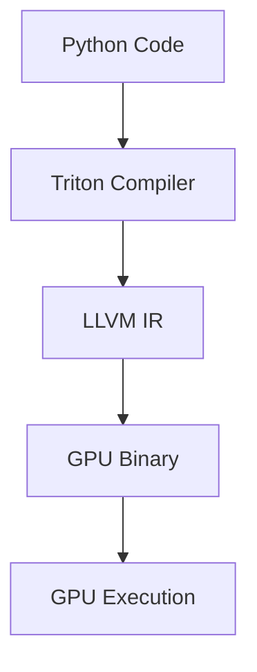
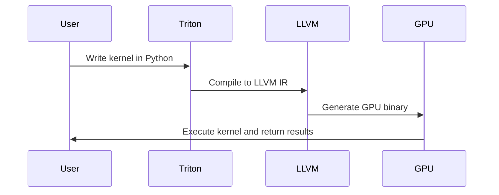
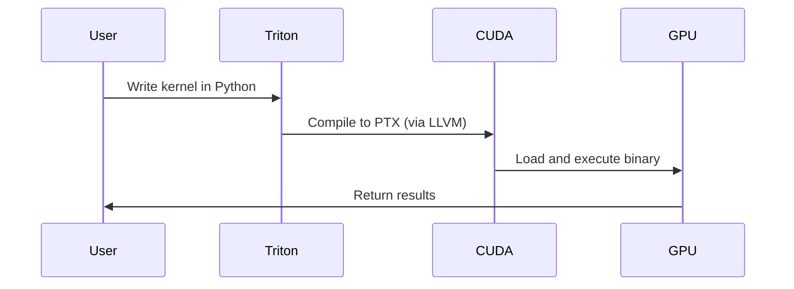

# Triton Introduction

Triton is an open-source programming language and compiler developed by OpenAI for writing highly efficient GPU code, especially for machine learning and AI workloads. Triton enables researchers and developers to write custom GPU kernels in Python-like syntax, making GPU programming more accessible and productive. However, writing efficient GPU code can still be challenging, and Triton aims to simplify this process and I'm using CUDA 12.9/13 on Windows as the GPU backend to run Triton.

## Key Features

- Pythonic syntax for easy learning
- Automatic parallelization and optimization
- Seamless integration with PyTorch
- Open-source and actively developed

## Triton Architecture

Below is a simplified architecture diagram of Triton:



### General Triton Workflow



### Triton & CUDA Workflow



## Example Use Case

Triton is ideal for custom deep learning layers, scientific computing, and accelerating AI research. It is used by leading organizations to optimize performance-critical workloads.

---

## Export Packages to requirements.txt using uv export

```bash
uv export --default-index https://pypi.org/simple --index https://download.pytorch.org/whl/cu130 --format requirements-txt --all-packages --index-strategy unsafe-best-match > requirements.txt
```

## Sync Environment

```bash
uv sync -U --index-strategy unsafe-best-match --all-packages --default-index https://pypi.org/simple --index https://download.pytorch.org/whl/cu130
```

## Lock and Upgrade Package

```bash
uv lock --upgrade --index-strategy unsafe-best-match --default-index https://pypi.org/simple --index https://download.pytorch.org/whl/cu130
```
